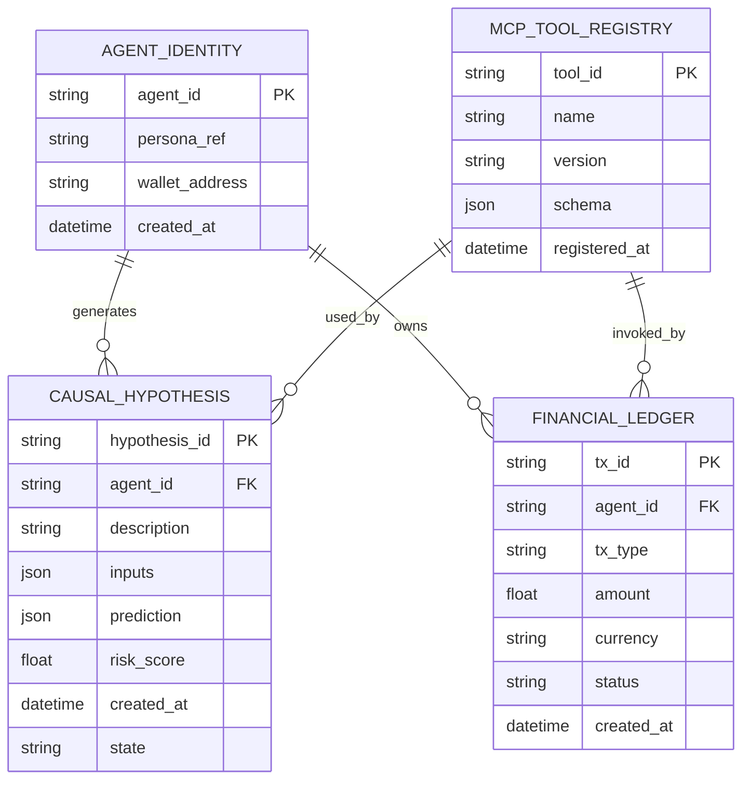

<!--
  Wrapped Spec Kit file: .specify/specs/technical.md
  Migrated from specs/technical.md — content preserved.
-->

# Feature Specification: Technical — NSC Blueprint

**Feature Branch**: `[migration/specs-into-spec-kit]`
**Created**: 2026-02-06
**Status**: Canonical (migrated)

```markdown
<!--
  specs/technical.md
  Technical blueprint for Neuro-Symbolic-Causal substrate, data model, API contracts, and Symbolic Guardian logic.
  References: Important docs/docs/SRS.md, research/architecture_strategy.md, research/research_analysis.md
-->

# Technical Specifications — Neuro‑Symbolic‑Causal Blueprint

Version: 2026-02-05

This file defines the core data model, JSON schemas and Pydantic API contracts, the Symbolic Guardian logic gate, and the recommended runtime/environment topology for Project Chimera's NSC architecture and polyglot persistence.

---

## 1. Data Model (Mermaid ERD)



Notes:
- `CAUSAL_HYPOTHESIS.prediction` stores the causal-simulator output (KPIs + variance). `risk_score` is normalized [0.0,1.0].
- `MCP_TOOL_REGISTRY.schema` is the tool capability descriptor used by Orchestrator validation.

---

## 2. API Interaction Contracts — JSON Schemas

Below are strict JSON schema fragments describing the Task lifecycle used for inter-agent communication.

TaskDraft (draft state)
```json
{
  "$id": "https://chimera.ai/schemas/task.draft.json",
  "type": "object",
  "required": ["task_id","agent_id","description","state","created_at"],
  "properties": {
    "task_id": {"type":"string"},
    "agent_id": {"type":"string"},
    "description": {"type":"string"},
    "resources": {"type":"array","items":{"type":"string"}},
    "cost_estimate": {"type":"number"},
    "priority": {"type":"string","enum":["low","medium","high"]},
    "state": {"type":"string","enum":["draft","signed","executed"]},
    "created_at": {"type":"string","format":"date-time"}
  }
}
```

TaskSigned (HITL signature present)
```json
{
  "$id": "https://chimera.ai/schemas/task.signed.json",
  "allOf": [ {"$ref":"https://chimera.ai/schemas/task.draft.json"} ],
  "required": ["signature"],
  "properties": {
    "signature": {
      "type":"object",
      "properties": {
        "signer_id": {"type":"string"},
        "sig_type": {"type":"string"},
        "signature": {"type":"string"},
        "signed_at": {"type":"string","format":"date-time"}
      }
    }
  }
}
```

TaskExecuted (result + ledger reference)
```json
{
  "$id":"https://chimera.ai/schemas/task.executed.json",
  "allOf": [ {"$ref":"https://chimera.ai/schemas/task.signed.json"} ],
  "required":["executed_at","result","audit_ref"],
  "properties": {
    "executed_at":{"type":"string","format":"date-time"},
    "result":{"type":"object"},
    "audit_ref":{"type":"string"}
  }
}
```

---

## 3. Pydantic Models (Python 3.12+)

Example Pydantic models that implement the Task state transitions and minimal validation. These are canonical contracts for services that accept or emit Task objects.

```python
from __future__ import annotations
from pydantic import BaseModel, Field, ValidationError
from typing import List, Optional
from datetime import datetime

class Signature(BaseModel):
    signer_id: str
    sig_type: str
    signature: str
    signed_at: datetime

class TaskDraft(BaseModel):
    task_id: str
    agent_id: str
    description: str
    resources: List[str] = []
    cost_estimate: float = 0.0
    priority: str = Field("medium", regex="^(low|medium|high)$")
    state: str = Field("draft", regex="^(draft|signed|executed)$")
    created_at: datetime = Field(default_factory=datetime.utcnow)

    def sign(self, signer_id: str, signature_payload: str) -> 'TaskSigned':
        sig = Signature(
            signer_id=signer_id,
            sig_type="HITL",
            signature=signature_payload,
            signed_at=datetime.utcnow(),
        )
        return TaskSigned(**self.dict(), signature=sig, state="signed")

class TaskSigned(TaskDraft):
    signature: Signature

    def execute(self, result: dict, audit_ref: str) -> 'TaskExecuted':
        return TaskExecuted(**self.dict(), result=result, audit_ref=audit_ref, executed_at=datetime.utcnow(), state="executed")

class TaskExecuted(TaskSigned):
    executed_at: datetime
    result: dict
    audit_ref: str

# Example usage:
try:
    draft = TaskDraft(task_id="t-1", agent_id="agent-42", description="Render hero video", cost_estimate=150.0)
    signed = draft.sign(signer_id="orchestrator:alice", signature_payload="sig-bytes")
    executed = signed.execute(result={"artifact_url":"https://..."}, audit_ref="ledger://tx-123")
except ValidationError as e:
    raise
```

Notes:
- Services that accept Task JSON MUST validate against the JSON Schema and the Pydantic models.

---

## 4. The Symbolic Guardian — Pseudo-code Logic Gate

This gate runs before any external side-effecting operation. It interrupts/neuters LLM (neuro) outputs that violate hard constraints.

```python
def symbolic_guardian_evaluate(action: dict, policy_store: PolicyStore, causal_simulator: CausalSimulator, cfo: CFO) -> DecisionRecord:
    # 1. Syntactic validation
    if not is_valid_action(action):
        return DecisionRecord(decision="REJECT", reason="malformed_action")

    # 2. Policy predicates (deterministic)
    predicates = policy_store.match_predicates(action)
    for p in predicates:
        if p.type == 'hard' and not p.evaluate(action):
            return DecisionRecord(decision="REJECT", reason=f"policy:{p.id}")

    # 3. Budget check via CFO
    if action.get("cost_estimate"):
        if not cfo.within_budget(action["agent_id"], action["cost_estimate"]):
            return DecisionRecord(decision="ESCALATE", reason="budget_exceeded")

    # 4. Causal simulation for first-order effects
    sim = causal_simulator.simulate(action)
    risk = sim.risk_score
    if risk > policy_store.get_threshold("max_auto_launch_risk"):
        return DecisionRecord(decision="ESCALATE", reason="causal_risk", details=sim.summary)

    # 5. All checks passed -> Approve
    return DecisionRecord(decision="APPROVE", reason="policy_clear", details={"risk":risk, "sim_id":sim.id})

# Invocation pattern: Judges and execution services must call symbolic_guardian_evaluate() and refuse to call MCP tools if Decision != APPROVE.
```

Key points:
- The Guardian runs offline from the LLM (separate service) and returns deterministic decisions.
- If `DecisionRecord.decision != 'APPROVE'`, runtime MUST NOT execute side-effecting MCP Tool calls.

---

## 5. Environment & Topology

Runtime
- Python: 3.12 (recommended) with `uvloop` for async performance.
- ASGI server: `uvicorn[standard]` + `uvloop` (for Planner, Judge, Orchestrator APIs).
- Framework: `FastAPI` for control-plane endpoints and HITL dashboard APIs.

Required packages (example pip requirements)
```
python>=3.12
pydantic>=2.0
fastapi
uvicorn[standard]
uvloop
mcp-sdk (organization-specific)
weaviate-client
redis
coinbase-agentkit
httpx

# dev/test
pytest

```

Topology (MCP Host / MCP Servers)
- MCP Host (Agent Runtime / Orchestrator): runs inside agent containers and exposes an MCP client which discovers MCP Servers via service registry.
- MCP Servers: one-per-capability (e.g., mcp-server-twitter, mcp-server-weaviate, mcp-server-ideogram, mcp-server-coinbase). Servers expose Resources & Tools primitives and run behind a validated transport (stdio for local, SSE or mTLS over TCP for remote).

Best practices
- Mutual authentication: Servers and Hosts authenticate using mTLS or signed JWTs.
- Capability manifests: Each MCP Server registers a manifest (name, schema, version, conformance-hash) that the Orchestrator verifies on deployment.
- CI conformance: Each MCP Server ships a conformance test suite that must pass in CI before being allowed into production manifests.

---

## 6. Operational Notes

- All cryptographic signing for HITL MUST use HSM or hardware-backed tokens; private keys never leave secret stores.
- Data retention and audit ledger export formats must be specified depending on regulatory policy; ledger entries should include evidence_packet references.

References
- Important docs/docs/SRS.md
- research/architecture_strategy.md
- research/research_analysis.md

-- End of `specs/technical.md`
```
