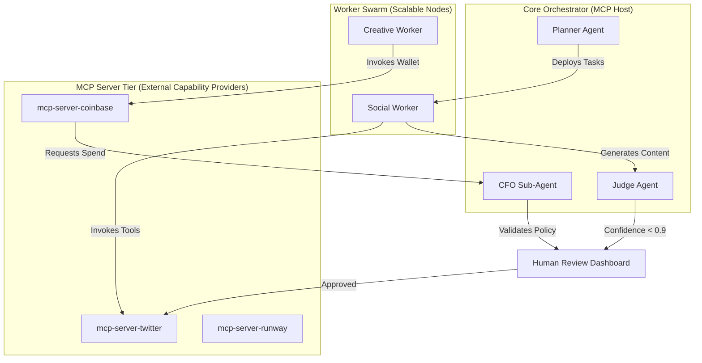

# Task 1.2 — Domain Architecture Strategy: Project Chimera 

## 1. Executive Summary

Project Chimera is an autonomous influencer ecosystem designed to solve the $230B creative supply chain failure through  **Agentic Orchestration** . This document outlines a high-governance architecture that replaces static automation with a **Neuro-Symbolic-Causal** framework, ensuring that every agent action is strategically sound, economically viable, and provably safe.

## 2. Agent Pattern: Hierarchical FastRender Swarm

Chimera adopts the  **FastRender Pattern** , a specialized hierarchical swarm architecture that rejects monolithic agent designs in favor of role-based specialization. This maximizes throughput and ensures that "thinking" (planning) is decoupled from "doing" (execution).

### A. Role Decomposition

* **The Planner (Neuro/Cognitive Core):** Acts as the "Strategist." It monitors global campaign goals and current market trends (via MCP Resources) to generate a **Directed Acyclic Graph (DAG)** of tasks.
* **The Worker Pool (Stateless Executors):** A fleet of ephemeral agents that pull atomic tasks from a  **Redis-backed TaskQueue** . Workers are the primary consumers of  **MCP Tools** , executing API calls for content generation or social posting in a "shared-nothing" environment to prevent cascading failures.
* **The Judge (Symbolic Guardian):** The critical governance layer. It validates Worker outputs against the Planner’s acceptance criteria and the **SOUL.md** persona constraints. The Judge utilizes  **Optimistic Concurrency Control (OCC)** , checking state versions before any commit to prevent race conditions in high-velocity environments.

## 3. Human-in-the-Loop (HITL) & Governance

To ensure brand safety and regulatory compliance (e.g., EU AI Act), Chimera implements a **Dynamic Escalation Framework** based on probability-based confidence scoring.

### The Three-Tier Review Logic:

* **Tier 1: Autonomous Approval (Confidence > 0.90):** Routine tasks with high model certainty are committed immediately.
* **Tier 2: Asynchronous Human Review (Confidence 0.70 - 0.90):** The task is paused, and the state is held in a  **ReviewQueue** . A human operator must approve or edit the content via the  **Orchestrator Dashboard** .
* **Tier 3: Mandatory Hard-Gate:** Regardless of confidence, any interaction involving **Agentic Commerce** (e.g., spending >$10 USDC) or "Sensitive Topics" (e.g., financial advice) triggers a mandatory human signature before the **Coinbase AgentKit** tool is invoked.

## 4. Data Persistence Strategy: Polyglot Persistence

Project Chimera utilizes a hybrid database architecture to meet the conflicting requirements of high-velocity social data and immutable financial ledgers.

| **Database**   | **Tier**       | **Role & Content**                                         | **Technical Justification**                                                       |
| -------------------- | -------------------- | ---------------------------------------------------------------- | --------------------------------------------------------------------------------------- |
| **Weaviate**   | **Semantic**   | Long-term memory, persona "DNA" (SOUL.md), and world knowledge.  | Vector-native storage allows for high-dimensionality RAG and cross-interaction recall.  |
| **PostgreSQL** | **Relational** | User accounts, multi-tenant configs, and campaign definitions.   | ACID compliance ensures strict isolation between different influencer "stable" tenants. |
| **Redis**      | **Episodic**   | Short-term context (last 1 hour) and Task/Review Queues.         | Sub-millisecond latency for the high-velocity Planner-Worker loop.                      |
| **On-Chain**   | **Ledger**     | Immutable record of all Agentic Commerce via**Base/EVM** . | Ensures transparent, unalterable auditing of autonomous financial agency.               |

## 5. Implementation Roadmap: The MCP Topology

The system is built as an **MCP Host** that connects to specialized **MCP Servers** via standardized transports (Stdio/SSE). This ensures that the core agent logic is decoupled from external API volatility (e.g., changes to the Instagram or TikTok APIs).

**Code snippet**



## 6. Strategic Advantage

This architecture positions Project Chimera as a **High-Governance Node** in the emergent agent economy. By combining the **FastRender Swarm's** operational efficiency with the **Symbolic Guardian's** rigorous safety checks, the platform provides a scalable, enterprise-ready alternative to unmanaged agentic systems

## 7. Strategic Conclusion: The Path to Autonomous Value

The architecture outlined in this document is not merely a collection of scripts, but a robust  **Agentic Production Factory** . By synthesizing the **Hierarchical FastRender Swarm** with a rigorous **Symbolic Guardian** and a **Polyglot Persistence** layer, Project Chimera establishes a defensible framework for the next generation of digital creators.

### Summary of Strategic Alignment:

* **Safety & Governance:** Through tiered HITL escalation and sandbox isolation, we solve the "wild-west" security risks highlighted in current open-source agent research (OpenClaw/Moltbook).
* **Operational Efficiency:** The decoupling of Planning from Execution ensures that the system can scale to manage thousands of influencer "personalities" without architectural drift.
* **Economic Readiness:** The inclusion of On-Chain Ledgers and Coinbase AgentKit transforms the system from a cost center into a self-sustaining business unit capable of autonomous procurement and revenue generation.

Project Chimera stands as a blueprint for  **High-Governance Agentic Systems** . We have successfully bridged the gap between "Vibe Coding" and "Specification-Driven Engineering," providing a transparent, auditable, and highly scalable platform ready for the 2026 agentic economy.

```

```
